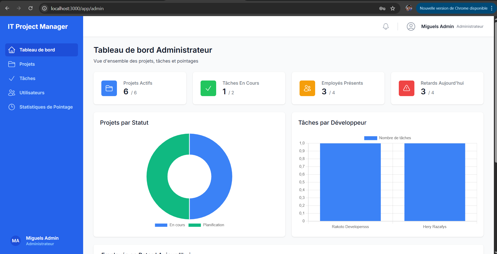
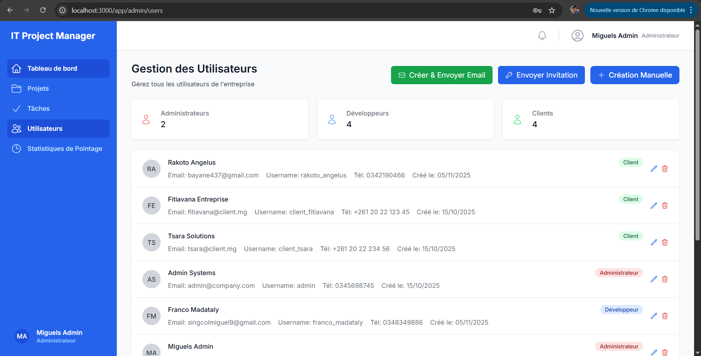
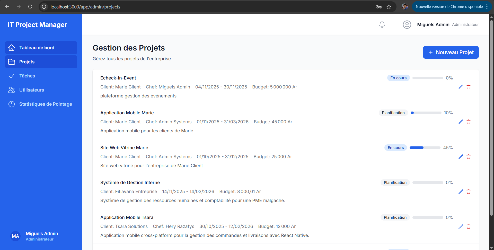
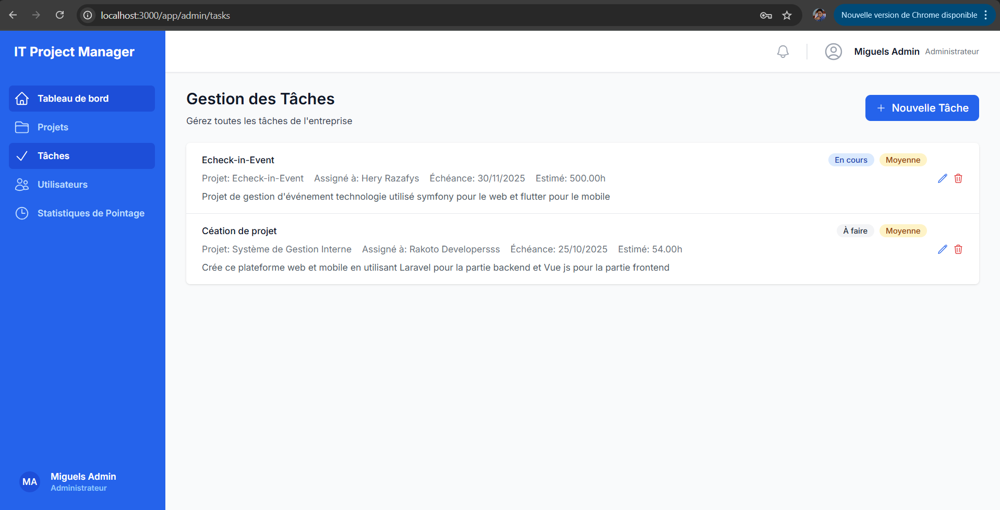
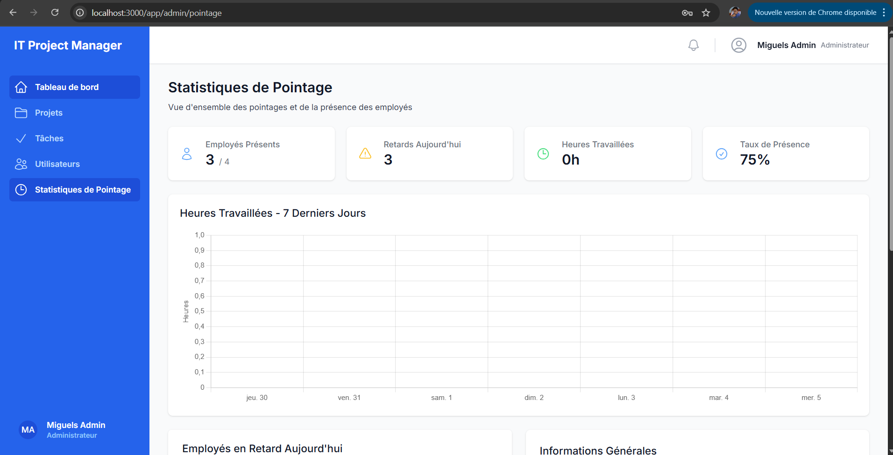

# IT Project Management System

## 📋 Description
Application web complète de gestion de projets IT avec système de pointage des employés et suivi client.

## 🖼️ Aperçu du projet

### Dashboard Admin


### Gestion des Utilisateurs


### Gestion des Projets


### Gestion des Tâches


### Statistiques de Pointage


*Plus de captures d'écran disponibles dans le dossier [screenshots/](screenshots/)*

## 🏗️ Architecture
- **Frontend**: React + TailwindCSS + Axios + React Router
- **Backend**: Django REST Framework + PostgreSQL
- **Authentification**: JWT (JSON Web Tokens)
- **Base de données**: PostgreSQL

## 👥 Rôles utilisateurs
1. **Admin**: Gestion complète (projets, tâches, employés, statistiques)
2. **Développeur**: Gestion des tâches assignées + pointage journalier
3. **Client**: Suivi des projets en lecture seule

## 🚀 Installation et lancement

### Prérequis
- Python 3.8+
- Node.js 16+
- PostgreSQL 12+

### Backend (Django)
```bash
cd backend
pip install -r requirements.txt
python manage.py migrate
python manage.py loaddata initial_data.json
python manage.py runserver
```

### Frontend (React)
```bash
cd frontend
npm install
npm start
```

### Base de données
Créer une base PostgreSQL nommée `it_project_management`

## 📁 Structure du projet
```
IT-Project-Management-System/
├── backend/                 # Django REST API
│   ├── core/               # Configuration principale
│   ├── apps/               # Applications Django
│   │   ├── authentication/ # Gestion utilisateurs & JWT
│   │   ├── projects/       # Gestion projets
│   │   ├── tasks/          # Gestion tâches
│   │   └── pointage/       # Système pointage
│   └── requirements.txt
├── frontend/               # React Application
│   ├── src/
│   │   ├── components/     # Composants réutilisables
│   │   ├── pages/          # Pages principales
│   │   ├── services/       # Services API
│   │   └── utils/          # Utilitaires
│   └── package.json
└── README.md
```

## 🔐 Comptes de test
- **Admin**: admin@company.com / admin123
- **Développeur**: dev@company.com / dev123  
- **Client**: client@company.com / client123

## 🌟 Fonctionnalités principales
- ✅ Authentification JWT multi-rôles
- ✅ Dashboard personnalisé par rôle
- ✅ Gestion CRUD complète (projets, tâches, utilisateurs)
- ✅ Système de pointage avec gestion des retards
- ✅ Statistiques et graphiques temps réel
- ✅ Interface responsive et moderne
- ✅ Suivi client en temps réel

## 👨‍💻 Auteur

**Miguel Singcol** - Développeur Full Stack
- Portfolio de démonstration de compétences techniques
- Spécialisé en React, Django, PostgreSQL

## 📄 Licence

Ce projet est sous licence MIT - voir le fichier [LICENSE](LICENSE) pour plus de détails.

## ⚠️ Note importante

Ce projet est un portfolio de démonstration. Pour une utilisation en production :
1. Changez toutes les clés secrètes
2. Configurez vos propres variables d'environnement
3. Adaptez la configuration de sécurité selon vos besoins
